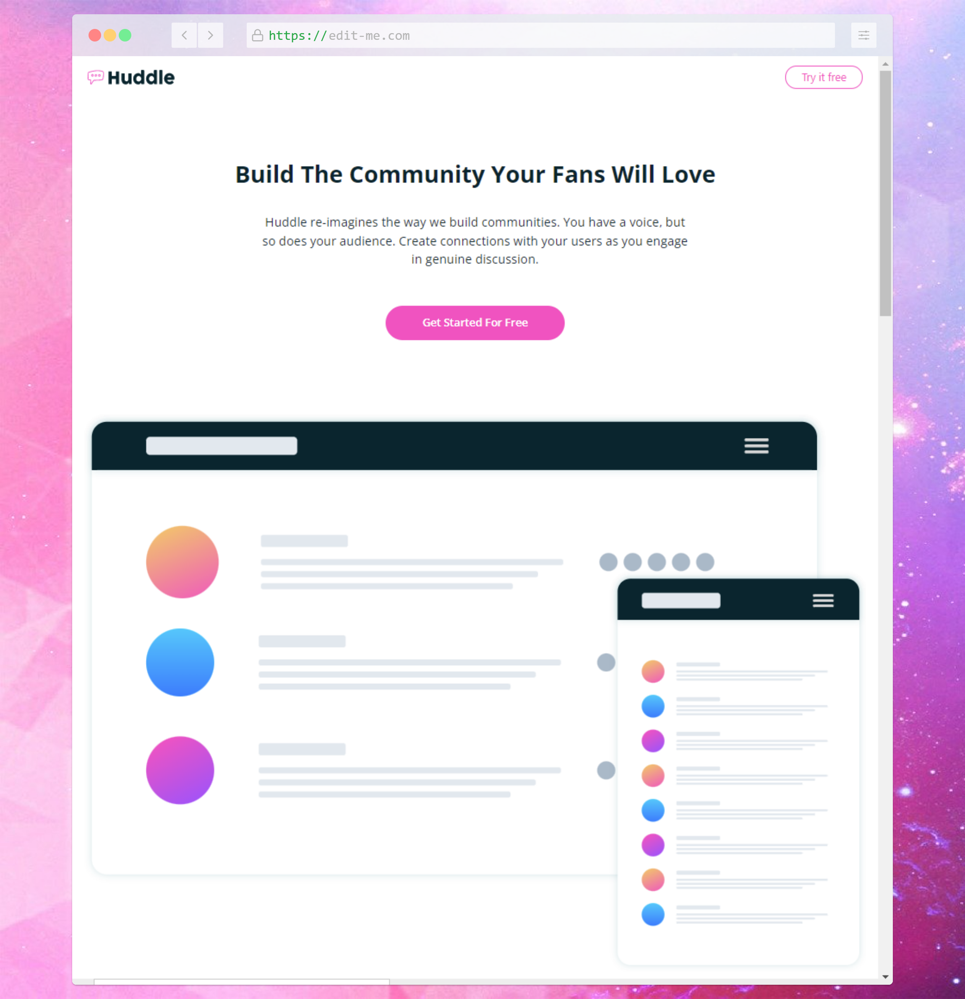

# Frontend Mentor template

**Time spent**: ~4 hours

**Submission date**: 1/3/2022

## Musings

- Aspect ratio can be used to responsively size images as desired including background images (especially useful with SVGs which have no cost to scaling). It can be used with elements too but most of stuff you expect to be responsive is already done by default, so it's not really useful for most elements.
- Lots of display:contents used for flexbox + desktop dimension purposes. Considered using grid but insufficiently prepared for proper alignment of items with it.
  Possible improvement: Could refactor some reusable styles, for example creating button classes.
- Note: Target breakpoints are 376px/1440px, but those are pretty big differences so I went for desktop dimensions of 1024px (default Tailwind `lg` breakpoint). Considering configuring exact breakpoints on next challenge, this was just an experiment to see if it would look alright on the screenshot (it was fine but had a noticeable size difference).

## Lessons taken (frontend/styles related)

_Notes don't particularly relate to the current challenge, more of a log of learned content._

[**CSS for JS devs**](https://courses.joshwcomeau.com/css-for-js)

reviewed fundamentals

- reviewed intro, style rule, media queries, selectors, combinators, color, units, typography, devtools
  - reminded that bg color can be used for text highlight effect
- Pseudo-classes: Reminded about checked styles which I rarely use
- Pseudo-elements: Reminded about before/after/placeholder, learned about accessibility concerns

rendering

- inheritance: similar to JS prototypes
- cascade: modern development (component-based) avoids specificity wars by default
- specificity (least to most prioritized): inherit -> tag -> class -> id -> inline -> important
- block and inline directions
- box model basics (w/h, margin, border... content-box / border-box

[Solution URL](https://www.frontendmentor.io/solutions/huddle-landing-page-using-tailwind-svelte-0-fXr84hQ)
[Live URL](https://fm-4-huddle-landing-page-with-curved-sections.pages.dev/)

## Built with

- Svelte Kit + static adapter
- Tailwind CSS (JIT mode)
- Cloudflare pages

**Other**

- VSCode Svelte extension
- pnpm for less dependency storage cost
